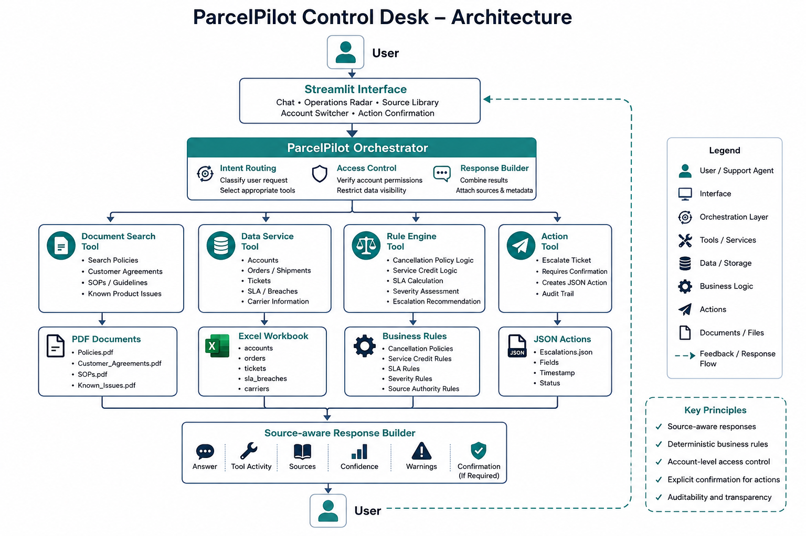

# ParcelPilot Control Desk

A source-aware AI support and operations system for ParcelPilot, a B2B logistics platform.

The application helps customers and internal support teams investigate orders, evaluate cancellation and service-credit eligibility, assess ticket severity and SLA status, search operational documents, and create controlled escalations.

## Live Application

**Hosted application:** YOUR_HOSTED_APP_URL

**Demo video:** YOUR_DEMO_VIDEO_URL

## Overview

ParcelPilot’s support team works across customer agreements, support policies, operating procedures, product documentation, historical tickets, and structured operational data.

These sources are not equally reliable:

* Signed customer agreements may override general policies.
* Current policies should supersede deprecated versions.
* Product documentation may contain active workarounds and known issues.
* Historical ticket resolutions are contextual and may contain incorrect guidance.
* Customer data must remain isolated by account.

ParcelPilot Control Desk addresses these concerns through deterministic business rules, source-aware retrieval, tool-level access control, visible evidence, and confirmation-gated actions.

## System Architecture



## Core Capabilities

### Support Assistant

The natural-language assistant can:

* Look up orders and tickets
* Evaluate shipment cancellation eligibility
* Calculate cancellation fees
* Evaluate failed-pickup service credits
* Classify ticket severity
* Check first-response SLA status
* Search policies, agreements, SOPs, and product documentation
* Prepare and confirm internal escalations

### Operations Radar

The internal operations dashboard proactively surfaces:

* Open P1 tickets
* SLA breaches
* Tickets requiring escalation
* Recurring issue patterns
* Cross-customer issue clusters
* Matches against known product issues
* Carrier-fault signals

### Source Library

The source workspace provides:

* Search over all supplied ParcelPilot documents
* Source status and authority visibility
* Account-scoped agreement access
* Optional deprecated-source access for internal audit review
* Exclusion of deprecated documents from normal answers

### Access Control

The application supports two contexts:

* **Customer:** restricted to the selected customer account
* **Support Operations:** authorised access across supplied accounts

Account restrictions are enforced inside structured-data and document tools rather than through prompt instructions alone.

## Example Requests

### Customer requests

```text
Can Northstar cancel ORD-1001 without a cancellation fee?
```

```text
Is ORD-2002 eligible for a service credit?
```

```text
Show me the details for TKT-501.
```

```text
What are the current support response targets?
```

### Internal support requests

```text
Assess the severity and SLA status of TKT-501.
```

```text
Escalate TKT-501 because it is a production outage.
```

```text
What is the workaround for large bulk uploads?
```

```text
Which open tickets require escalation?
```

## Source Reliability Model

The application applies the following authority order:

1. Signed customer agreement
2. Current support policy or operating procedure
3. Current product documentation
4. Structured operational data
5. Historical ticket resolutions as non-authoritative context
6. Deprecated documents for audit review only

Customer agreements are also account-scoped. A customer cannot retrieve another customer’s agreement.

## Agent and Tool Design

The system uses a central orchestrator that identifies intent and selects the appropriate tool.

### Tool 1: Document Search

Searches:

* Current support policy
* Cancellation and service-credit SOP
* Product operations guide
* Account-specific agreements
* Deprecated policy only when explicitly enabled for internal audit

### Tool 2: Structured Data Lookup

Queries:

* Accounts
* Orders
* Support tickets

The tool applies account restrictions before returning data.

### Tool 3: Deterministic Rule Engine

Calculates:

* Cancellation eligibility
* Cancellation fees
* Service-credit eligibility
* Service-credit amount
* Ticket severity
* SLA target
* SLA breach status

Financial and policy-sensitive decisions are calculated in Python rather than generated by a language model.

### Tool 4: State-Changing Action

Supports mocked escalation creation.

The workflow has two stages:

1. Prepare the escalation
2. Execute only after explicit confirmation

Pending and completed actions are stored locally as JSON records.

## Multi-Step Workflow Example

For the request:

```text
Can Northstar cancel ORD-1001 without a cancellation fee?
```

The system:

1. Extracts the order identifier
2. Looks up the order
3. Identifies the order’s account
4. Reads the applicable Northstar agreement
5. Applies the agreement before the default SOP
6. Calculates the cancellation decision
7. Returns the answer with tool activity and sources

## Technology Stack

* Python
* Streamlit
* Pandas
* OpenPyXL
* PyPDF
* Pytest
* HTML and CSS
* Streamlit Community Cloud
* Git and GitHub

## Project Structure

```text
parcelpilot-ai-support-copilot/
├── app.py
├── app/
│   ├── agent/
│   │   ├── orchestrator.py
│   │   └── response.py
│   ├── models/
│   │   └── document.py
│   ├── services/
│   │   ├── data_service.py
│   │   ├── document_service.py
│   │   └── insight_service.py
│   ├── tools/
│   │   ├── action_tool.py
│   │   ├── result.py
│   │   └── support_tools.py
│   ├── ui/
│   │   └── styles.py
│   └── config.py
├── data/
│   ├── documents/
│   ├── actions/
│   └── ParcelPilot_Assessment_Data.xlsx
├── docs/
├── tests/
├── requirements.txt
└── README.md
```

## Local Setup

### 1. Clone the repository

```bash
git clone https://github.com/samriddhi-bisht/parcelpilot-ai-support-copilot.git
cd parcelpilot-ai-support-copilot
```

### 2. Create a virtual environment

Windows PowerShell:

```powershell
python -m venv .venv
.\.venv\Scripts\Activate.ps1
```

Git Bash:

```bash
python -m venv .venv
source .venv/Scripts/activate
```

### 3. Install dependencies

```bash
python -m pip install --upgrade pip
python -m pip install -r requirements.txt
```

### 4. Run the application

```bash
python -m streamlit run app.py
```

Open:

```text
http://localhost:8501
```

## Running Tests

```bash
python -m pytest -v
```

The test suite covers:

* Dataset loading
* Account-scoped order access
* Document loading
* Deprecated-source exclusion
* Customer-agreement isolation
* Cancellation rules
* Service-credit rules
* Ticket triage
* Escalation preparation and confirmation
* Natural-language routing
* Proactive issue detection

## Important Product Decisions

### Deterministic Policy Decisions

A language model is not used to calculate fees, credits, severity, or SLA breaches. These decisions use explicit Python rules for reliability and testability.

### Tool-Level Privacy

Customer account restrictions are enforced before data reaches the response layer.

### Confirmation Before Actions

Escalations are prepared first and executed only after the user explicitly confirms the action.

### Visible Sources and Tool Activity

The interface exposes:

* Selected tools
* Tool results
* Sources used
* Confidence level
* Warnings and uncertainty

### Lightweight Retrieval

The supplied documents are small, so metadata-aware keyword retrieval was selected instead of adding a vector database. This reduces complexity, latency, and deployment risk while remaining sufficient for the assessment dataset.

## Current Limitations

The submitted version intentionally uses:

* Mocked authentication
* Local JSON action storage
* Rule-based intent routing
* In-memory document loading
* Keyword-based document retrieval
* Dataset-specific policy rules

It does not include:

* Production identity management
* Persistent cloud database
* Real ticketing-platform integration
* Carrier API integration
* Semantic embedding infrastructure
* Production monitoring and audit infrastructure

## Future Development

The next priorities would be:

1. Enterprise authentication and role-based access control
2. Persistent action and audit database
3. Zendesk, Freshdesk, or Salesforce integration
4. Carrier status verification
5. Semantic and hybrid retrieval
6. Evaluation dataset and answer-quality monitoring
7. Human feedback and resolution tracking
8. Automated SLA and issue-cluster notifications

## Success Metric

The primary product metric would be:

**Correct Resolution Rate without Human Rework**

This measures the percentage of assistant-supported cases resolved correctly without requiring an agent to correct the answer or repeat the investigation.

Supporting metrics would include:

* First-contact resolution rate
* Median investigation time
* Incorrect answer rate
* Escalation precision
* SLA-breach detection recall

## AI Tool Usage

AI coding assistance was used for implementation planning, code scaffolding, debugging support, test-case generation, documentation structuring, and UI iteration.

All generated output was reviewed, adapted to the supplied ParcelPilot data, tested locally, and integrated manually. Policy-sensitive decisions, access rules, and calculations were implemented as explicit application logic rather than delegated to generated model responses.

## Author

**Samriddhi Bisht**
